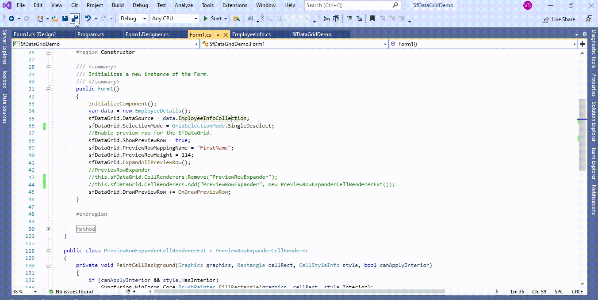
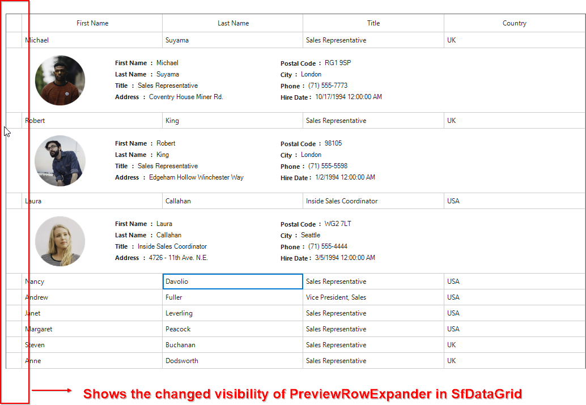

# How to change the visibility of PreviewRowExpander in WinForms DataGrid (SfDataGrid)?

## About the sample
This example illustrates how to change the visibility of PreviewRowExpander in [WinForms DataGrid](https://www.syncfusion.com/winforms-ui-controls/datagrid) (SfDataGrid)?

[WinForms DataGrid](https://www.syncfusion.com/winforms-ui-controls/datagrid) (SfDataGrid) does not provide the direct support to change the visibility of **PreviewRowExpander**. You can change the visibility of **PreviewRowExpander** by overriding [OnRender](https://help.syncfusion.com/cr/windowsforms/Syncfusion.WinForms.DataGrid.Renderers.PreviewRowExpanderCellRenderer.html#Syncfusion_WinForms_DataGrid_Renderers_PreviewRowExpanderCellRenderer_OnRender_System_Drawing_Graphics_System_Drawing_Rectangle_System_String_Syncfusion_WinForms_DataGrid_Styles_CellStyleInfo_Syncfusion_WinForms_DataGrid_DataColumnBase_Syncfusion_WinForms_GridCommon_ScrollAxis_RowColumnIndex_) method in [PreviewRowExpanderCellRenderer](https://help.syncfusion.com/cr/windowsforms/Syncfusion.WinForms.DataGrid.Renderers.PreviewRowExpanderCellRenderer.html).

```C#
//PreviewRowExpander
this.sfDataGrid.CellRenderers.Remove("PreviewRowExpander");
this.sfDataGrid.CellRenderers.Add("PreviewRowExpander", new PreviewRowExpanderCellRendererExt());

public class PreviewRowExpanderCellRendererExt : PreviewRowExpanderCellRenderer
{
        private void PaintCellBackground(Graphics graphics, Rectangle cellRect, CellStyleInfo style, bool canApplyInterior)
        {
            if (canApplyInterior && style.HasInterior)
                Syncfusion.WinForms.Core.BrushPainter.FillRectangle(graphics, cellRect, style.Interior);
            else
            {
                Brush backColor = new SolidBrush(style.BackColor);
                graphics.FillRectangle(backColor, cellRect);
                Syncfusion.ComponentModel.DisposeHelper.Dispose(ref backColor);
            }
        }

        protected override void OnRender(Graphics paint, Rectangle cellRect, string cellValue, CellStyleInfo style, DataColumnBase column, RowColumnIndex rowColumnIndex)
        {
            // To draw background for the Expander cell.
            PaintCellBackground(paint, cellRect, style, true);
        }
}

```


The following screenshot shows the changed visibility of PreviewRowExpander in [WinForms DataGrid](https://www.syncfusion.com/winforms-ui-controls/datagrid) (SfDataGrid),



Take a moment to peruse the [WinForms DataGrid – Preview Rows](https://help.syncfusion.com/windowsforms/datagrid/previewrows) documentation, where you can find about Preview Rows with code examples.

Please refer this [link](https://www.syncfusion.com/winforms-ui-controls/datagrid) to know about the essential features of WinForms DataGrid.

## Requirements to run the demo
Visual Studio 2015 and above versions
